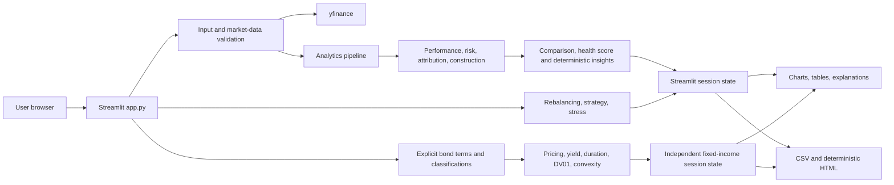
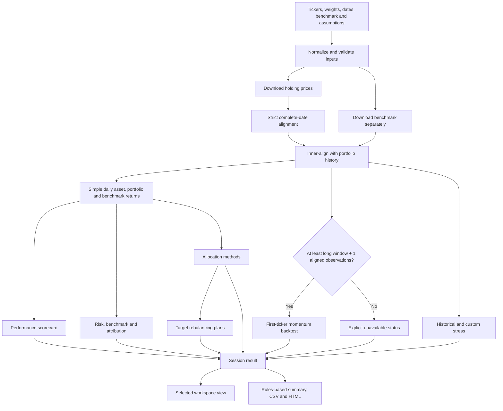
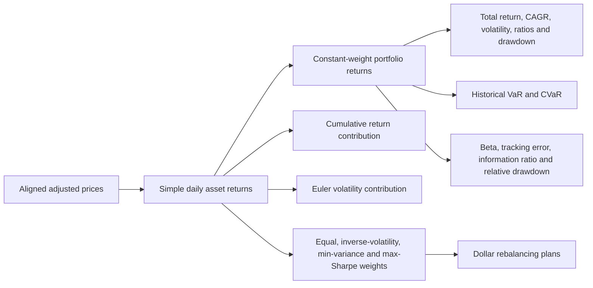
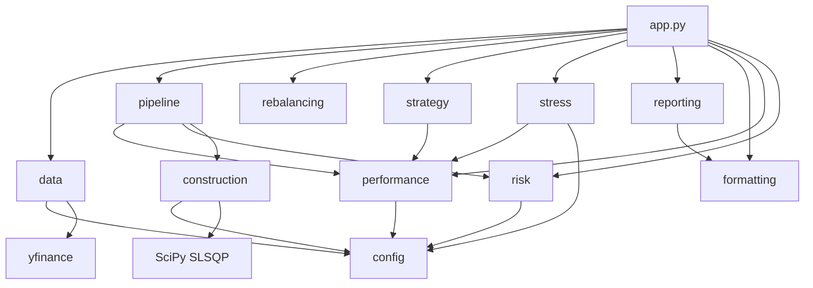
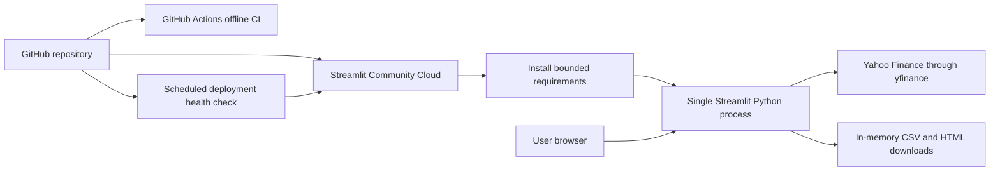

# Architecture

This is the living technical reference for maintaining, extending, testing, deploying, and explaining PortfolioLens. For formulas and assumptions, see [Methodology](METHODOLOGY.md). For rationale, see [Decisions](DECISIONS.md). For future work, see the [Roadmap](ROADMAP.md).

## A. System overview

The application is a single-process Streamlit dashboard backed by a small functional Python package. The browser sends user inputs to Streamlit; Streamlit validates them, downloads adjusted history from yfinance, invokes pure analytics functions, retains the resulting analysis in session state, and renders only the selected workspace view. There is no database, authentication layer, background worker, paid API, or live-trading connection.

### Information architecture

The UI has six primary workspaces. `PRIMARY_WORKSPACES`, `WORKSPACE_SECTIONS`, and `SECTION_TO_WORKSPACE` in `app.py` are the authoritative navigation registry. A Streamlit segmented control selects the primary workspace; a native select box chooses a secondary view only when the workspace has more than one. The compatibility state key `analysis_tab` remains supported so saved sessions and existing deep-link/test flows can address former section names while `primary_workspace` and `workspace_section` hold the new navigation state.

| Workspace | Views |
|---|---|
| Dashboard | Dashboard |
| Analytics | Performance; Performance Evaluation; Risk; Benchmark & Attribution; Stress Testing |
| Research | Security Analysis; Asset Pricing; ETF Research; Fixed Income |
| Portfolio Construction | Portfolio Optimization & Rebalancing; Asset Allocation |
| Strategies | Portfolio Strategies & Momentum |
| Reports | Research Workspace; Research Report; Methodology & Limitations |

Global analysis inputs stay in the sidebar across workspace changes. Calculation results live in `st.session_state["result"]`; changing workspace does not recompute or discard them. Input changes call `clear_analysis_state`, and a failed run clears old outputs before validation so stale results cannot survive an error.

### Visual layout contract

- The opening sidebar order is portfolio inputs, paired analysis dates, benchmark, Run analysis, Reset, then collapsed Advanced assumptions, Implementation, Strategy settings, and About sections.
- Run analysis must remain visible without sidebar scrolling at 1366×768 and 1440×900. The layout uses native Streamlit containers and columns instead of sticky CSS.
- The analytical canvas uses one shared left edge and `width="stretch"` for charts, tables, editors, and secondary navigation.
- Dashboard metrics are ordered as portfolio outcomes first and benchmark-relative diagnostics second. Fixed-width cards fill the common laptop canvas and wrap at narrower widths without truncating values.
- Plotly figures and fixed-income native charts use a 400-pixel standard height. Two-up charts share equal Streamlit columns; wide tables retain internal scrolling and must not create page-level horizontal overflow.
- Streamlit owns outer page padding, responsive breakpoints, and dataframe toolbars. These are accepted framework constraints and are not overridden with fragile CSS selectors.



## B. Repository structure

```text
app.py                              Streamlit entrypoint, controls, navigation and views
portfolio_dashboard/
  __init__.py                       package marker and package description
  config.py                         shared constants, benchmark aliases, presets and stress windows
  data.py                           input validation, benchmark resolution and yfinance price boundary
  performance.py                    returns and performance scorecard
  evaluation.py                     Fama evaluation, source attribution, Modified Dietz and rolling diagnostics
  risk.py                           tail, benchmark, security-regression and contribution analytics
  research.py                       comparison, score, scenario and deterministic insight diagnostics
  construction.py                   annualized inputs, constrained optimizers, frontier/CAL diagnostics and utility
  fixed_income.py                   bond cash flows, pricing, yield, duration, DV01, convexity and repricing
  bond_portfolio.py                 aggregation, rate scenarios, filters, rankings and linear construction
  fixed_income_ui.py                independent fixed-income Streamlit view and state wiring
  pipeline.py                       main analytics orchestration and Analysis result
  rebalancing.py                    target-allocation, policy simulation and benchmark comparison
  strategy.py                       lagged moving-average backtest
  stress.py                         custom and historical scenarios
  reporting.py                      deterministic narrative and HTML report
  formatting.py                     semantic presentation formatting
tests/
  test_analytics.py                 synthetic unit and integration tests
  test_app.py                       offline Streamlit entrypoint smoke tests
  test_public_language.py           public product-terminology guard
  test_workflow.py                  deterministic four-ETF research workflow
  test_fixed_income.py              deterministic bond and bond-portfolio reconciliation
.github/workflows/
  ci.yml                            offline code and non-socket app verification
  deployment-health.yml             scheduled public-endpoint classification
scripts/
  validate_markdown_links.py        tracked local Markdown-target validation
  check_deployment.py               credential-free deployment health diagnostics
docs/
  ARCHITECTURE.md                   this living technical reference
  DECISIONS.md                      accepted decisions and consequences
  METHODOLOGY.md                    formulas, conventions and limitations
  PROJECT_HISTORY.md                concise evidence-backed milestones
  PROJECT_JOURNAL.md                chronological engineering narrative
  ROADMAP.md                        completed, planned, deferred and avoided work
CHANGELOG.md                        user-facing milestone changes
README.md                           product overview and operating instructions
docs/DEPLOYMENT.md                  Community Cloud runbook and verification
docs/DEMO_GUIDE.md                  reproducible interview walkthrough
docs/SHOWCASE_REVIEW.md             visual and functional review findings
docs/images/                        optimized live-application captures
requirements.txt                   bounded runtime and test dependencies
pytest.ini                          local pytest configuration
```

## C. Major modules and responsibilities

### `app.py` — application orchestration and presentation

- **Why it exists:** Provides the Streamlit user experience and connects package outputs to charts, tables, controls, warnings, and downloads.
- **Owns:** Page configuration, grouped sidebar widgets, cached download wrapper, session state, selected-view rendering, Plotly charts, and export buttons.
- **Does not own:** Core financial formulas, yfinance response parsing, optimizer objectives, backtest mechanics, shock calculations, or HTML construction.
- **Key inputs:** Tickers, weights, dates, benchmark, initial value, risk-free rate, transaction cost, and moving-average windows.
- **Key outputs:** Rendered workspace views, messages, CSV payloads, and an HTML report download.
- **Important dependencies:** Streamlit, Plotly, pandas, and all public package modules used by the workflow.
- **Financial concepts:** Presents all analytics but directly calculates only view-specific transformations such as 63-day rolling volatility and wealth curves.
- **Common failure modes:** Invalid widget combinations, data-provider errors, insufficient strategy history, unavailable optimized allocations, or stale session choices. Actionable validation errors are displayed; allocation failures appear as warnings.
- **How tested:** `tests/test_app.py` checks the initial state and verifies multiple benchmark tickers are rejected before download. Full financial behavior is tested below the UI boundary.

### `config.py` — shared conventions and fixed configuration

- **Why it exists:** Prevents unexplained constants and scenario dates from being scattered across modules.
- **Owns:** `TRADING_DAYS`, weight tolerance, minimum observations, historical stress dates, and example presets.
- **Does not own:** Mutable user settings or runtime state.
- **Key inputs:** None.
- **Key outputs:** Imported constants and dictionaries.
- **Important dependencies:** None.
- **Financial concepts:** Annualization convention and fixed scenario windows.
- **Common failure modes:** A convention change can affect several formulas; a scenario label/date change can alter historical outputs.
- **How tested:** Indirectly through performance, validation, stress, construction, and integration tests.

### `data.py` — validation and external-data boundary

- **Why it exists:** Keeps unreliable external responses and user input outside the calculation core.
- **Owns:** Ticker normalization, date and weight validation, yfinance layout parsing, failed-symbol detection, strict common-date alignment, and market-data exceptions.
- **Does not own:** Return calculation, benchmark metrics, caching, or UI messages.
- **Key inputs:** Raw ticker/date/weight values and yfinance DataFrames.
- **Key outputs:** Validated `pd.Series` weights and finite, complete adjusted-price DataFrames.
- **Important dependencies:** pandas, NumPy, yfinance, and configuration tolerances.
- **Financial concepts:** Adjusted-price selection, long-only normalized weights, and common trading-date policy.
- **Common failure modes:** Empty inputs, duplicate symbols, mismatched weights, invalid dates, missing price fields, unavailable tickers, or too few common observations.
- **How tested:** Ticker/weight validation, single- and MultiIndex extraction, and missing-data policy tests use local fixed data.

### `performance.py` — return and performance calculations

- **Why it exists:** Centralizes reusable performance formulas for portfolios and strategies.
- **Owns:** Simple returns, constant-weight portfolio returns, arithmetic annualized return, CAGR, annualized variance/volatility, portfolio `w′μ` and `w′Σw`, Sharpe, Sortino, drawdown, Calmar, scorecards, and monthly returns.
- **Does not own:** Benchmark regression, asset contributions, allocation optimization, or display formatting.
- **Key inputs:** Price or return Series/DataFrames, labeled weights, annual risk-free rate, and optional periods per year.
- **Key outputs:** Return series, scalar metrics, metric dictionaries, drawdown series, and monthly tables.
- **Important dependencies:** pandas, NumPy, and `TRADING_DAYS`.
- **Financial concepts:** Daily simple returns, arithmetic expected return, compound growth, sample variance/volatility, covariance-matrix portfolio moments, arithmetic excess-return Sharpe, target downside deviation, and initial-wealth drawdown.
- **Common failure modes:** Empty returns, nonpositive compound wealth for CAGR, zero volatility, invalid weight labels, missing asset returns, or no downside observations.
- **How tested:** Known synthetic returns cover aggregation, CAGR, volatility, Sharpe, Sortino, drawdown, and integration reconciliation.

### `risk.py` — market risk, benchmark comparison and attribution

- **Why it exists:** Groups portfolio-risk and benchmark-relative methods that depend on aligned returns.
- **Owns:** Historical VaR/CVaR, excess-return single-index OLS, CAPM evaluation metrics, tracking error, information ratio, benchmark metrics, Euler volatility contribution, and cumulative total-return contribution.
- **Does not own:** Price downloads, performance scorecards, optimized weights, or UI concentration calculations.
- **Key inputs:** Portfolio, benchmark and asset daily returns plus labeled weights.
- **Key outputs:** Scalar risk/benchmark metrics, regression/risk-decomposition diagnostics, CAPM performance metrics, and contribution Series.
- **Important dependencies:** pandas, NumPy, and `TRADING_DAYS`.
- **Financial concepts:** Empirical lower-tail loss, covariance beta, active risk, relative drawdown, Euler decomposition, and contribution reconciliation.
- **Common failure modes:** Invalid confidence, empty tails, fewer than three aligned regression observations, zero benchmark variance, zero tracking error, nonpositive portfolio variance, or misaligned labels.

### `asset_pricing.py` — CAPM and assumption-based factor pricing

- **Why it exists:** Keeps Security Market Line and linear factor-pricing calculations independent from Streamlit presentation and from regression estimation.
- **Owns:** CAPM required return, realized-minus-required alpha, sorted SML coordinates, security-level CAPM comparison tables, and supplied-exposure factor contribution arithmetic.
- **Does not own:** Live factor downloads, rolling regressions, factor selection, security recommendations, or market-data retrieval.
- **Key inputs:** Annual arithmetic returns and risk-free rate in common decimal units, regression beta, or explicitly supplied factor exposures and premia.
- **Key outputs:** CAPM comparison tables, SML coordinates, and factor contribution reconciliation tables.
- **How tested:** Deterministic zero/negative/high-beta cases, risk-free and market sensitivity, aligned synthetic regressions, and factor contribution reconciliation.

### `research.py` — deterministic investment research diagnostics

- **Why it exists:** Keeps research interpretation and scenario mathematics testable and independent of Streamlit and report rendering.
- **Owns:** Like-for-like allocation comparison, Portfolio Health Score decomposition and coverage, validated long-only what-if comparison, explicit shock reuse, and rules-based insight evidence.
- **Key inputs:** Aligned asset returns, current and candidate weights, existing performance/benchmark dictionaries, volatility contributions, CVaR, explicit shocks, portfolio value, and risk-free rate.
- **Key outputs:** Comparison DataFrames, score/component audit table, scenario tables and summary, and insight rows containing observation, metric, value, and rule.
- **Does not own:** Market-data retrieval, optimization, investor suitability, recommendations, forecasts, Streamlit state, or prose generation by an LLM.
- **How tested:** Synthetic cases reconcile comparison metrics, score points and coverage, weight distance, scenario shock impact, and the traceability/prohibited-language contract.
- **Common failure modes:** Mismatched labels, negative/nonfinite weights, weights not summing to 100%, incomplete shocks, or unavailable score inputs.

### `construction.py` — allocation comparisons

- **Why it exists:** Separates investment-weight construction from current holdings and rebalancing execution.
- **Owns:** Equal weight, inverse volatility, GMV, maximum Sharpe, target-return portfolios, efficient frontier, non-leveraged CAL and complete-portfolio composition, explicit asset/group constraints, linear feasibility checks, SLSQP optimization, convergence checks, and per-method warning isolation.
- **Does not own:** Forecast models, risk-parity/ERC, trade execution, inferred classifications, or recommendations.
- **Key inputs:** Complete asset-return DataFrames, risk-free rate, targets, explicit bounds, user-entered group labels, and group caps.
- **Key outputs:** Labeled weights, optimizer statistics, frontier/CAL tables, risk-free/tangency complete-portfolio weights, constraint validation, allocation comparisons, and warnings.
- **Important dependencies:** pandas, NumPy, SciPy `linprog`/SLSQP, and `TRADING_DAYS`.
- **Financial concepts:** Inverse volatility, sample covariance, arithmetic expected return, GMV, target-return construction, constrained tangency, efficient frontier, CAL, and policy constraints.
- **Common failure modes:** Zero volatility, nonfinite estimates, insufficient observations, degenerate covariance, infeasible constraints, or solver nonconvergence.
- **How tested:** Feasibility, targets, sum-to-one, bounds, monotonicity, reproducibility, CAL endpoints, group caps, exclusions, validation summaries, and failure isolation.

### `fixed_income.py` — explicit bond calculation core

- **Why it exists:** Prevents bond characteristics from being inferred from ETF/ticker history and gives pricing/rate-risk formulas one pure source of truth.
- **Owns:** Coupon schedules, Actual/Actual and 30/360 accrual, clean/dirty price, current yield, bracketed YTM recovery, Macaulay/modified/dollar duration, DV01, convexity, duration approximations, full repricing, and error measurement.
- **Does not own:** Streamlit state, market-data downloads, curve construction, credit models, embedded options, liabilities, or recommendations.
- **Key inputs:** Explicit face, coupon, frequency, settlement, maturity, day count, clean price or nominal annual YTM, and basis-point shock.
- **How tested:** Par/premium/discount/zero-coupon pricing, four frequencies, accrued interest, YTM recovery/failure, duration units, DV01, convexity, and full-repricing reconciliation.

### `bond_portfolio.py` — bond portfolio research

- **Why it exists:** Keeps aggregation, scenarios, selection, and construction reproducible outside the UI.
- **Owns:** Dirty-market-value weights; YTM/duration/DV01/convexity aggregation and contributions; parallel-rate scenarios; explicit filters; single-formula rankings; and long-only linear construction with position, duration, maturity-bucket, classification, yield, and duration constraints.
- **Does not own:** Classification inference, hidden scoring, binary security selection, liability immunization, or credit/curve forecasts.
- **Key outputs:** Reconciled holding tables, portfolio summaries, scenario contributions, ranked candidates with formula text, constructed weights, and constraint validation.
- **How tested:** Market-value and contribution sums, positive/negative/zero/large shocks, filters, duplicate/missing classifications, rankings, duration targets/bands, caps, yield floors, and maturity buckets.

### `fixed_income_ui.py` — fixed-income presentation boundary

- **Why it exists:** Keeps explicit instrument inputs separate from the global equity/ETF market-history sidebar while preserving the six primary workspaces.
- **Owns:** Calculator, portfolio, scenario, selection/construction controls, result-first tables/cards, downloads, and `fi_*` session keys.
- **State boundary:** Completed fixed-income outputs survive workspace navigation independently of `st.session_state["result"]`. Fixed Income renders before the market-history empty-state stop and never triggers yfinance.
- **How tested:** AppTest verifies reachability before any market-data run, four secondary views, calculator metrics, portfolio/scenario/selection state, and exports.

### `pipeline.py` — main analytics composition

- **Why it exists:** Provides one reusable path shared by Streamlit and integration tests.
- **Owns:** Portfolio/benchmark inner alignment, return creation, core scorecards, contribution calculations, allocation comparison, and the immutable `Analysis` result.
- **Does not own:** External downloads, input parsing, strategy, stress, rebalancing plans, reporting, or UI state.
- **Key inputs:** Already validated holding prices, benchmark prices, weights, and risk-free rate.
- **Key outputs:** Frozen `Analysis` dataclass containing aligned data and all core results.
- **Important dependencies:** `performance`, `risk`, and `construction`.
- **Financial concepts:** The complete constant-weight portfolio analytics path.
- **Common failure modes:** Fewer than three common portfolio/benchmark price observations or downstream validation/optimizer warnings.
- **How tested:** The integration test verifies portfolio return, return-contribution, volatility-contribution, and allocation reconciliation end to end.

### `rebalancing.py` — target trade plans and holdings-level policy simulation

- **Why it exists:** Separates target trade instructions and path-dependent implementation policies from constant-weight analytics.
- **Owns:** Current/target gaps, dollar trades, buy/sell labels, holdings drift, periodic/threshold triggers, one-way turnover, proportional costs, and aligned benchmark-relative policy comparison.
- **Does not own:** Tax lots, whole-share rounding, cash flows, liquidity, market impact, cost-aware optimization, or execution.
- **Key inputs:** Asset and optional benchmark returns, target weights, value, policy, drift threshold, transaction-cost rate, risk-free rate, and optional display hold threshold.
- **Key outputs:** Target plan, daily policy histories, before/after trade histories, rebalance dates, and comparison statistics.
- **Important dependencies:** pandas, NumPy, and `performance_metrics`.
- **Financial concepts:** Self-financing pre-cost trades, weight drift, calendar/threshold rebalancing, turnover, costs, and path continuity.
- **Common failure modes:** Invalid value/cost/threshold, unsorted or incomplete returns, returns at/below -100%, mismatched weights, or unknown policy.
- **How tested:** No-trade paths, calendar schedules, threshold breaches, turnover, costs, continuity, drift, and trade/cost reconciliation.

### `strategy.py` — moving-average backtest

- **Why it exists:** Implements one transparent systematic strategy without bloating the core portfolio model.
- **Owns:** Moving averages, readiness, signal, one-day-lagged position, turnover, proportional transaction cost, post-warm-up comparison, growth series, and strategy statistics.
- **Does not own:** Parameter search, machine learning, portfolio-level execution, taxes, slippage beyond the configured cost, or live orders.
- **Key inputs:** One price Series, short/long windows, proportional cost, and risk-free rate.
- **Key outputs:** An optional-module result containing either a detailed backtest DataFrame and metric dictionary or an explicit unavailable status, aligned observation counts, and reason. Missing results are represented as `None`, never fake performance.
- **Important dependencies:** pandas, NumPy, and `performance_metrics`.
- **Financial concepts:** Trend following, long/cash exposure, look-ahead avoidance, turnover, costs, time in market, and common-period comparison.
- **Common failure modes:** Invalid windows, fewer than `long_window + 1` aligned observations, invalid transaction cost, no active days, or no losing active returns.
- **How tested:** Exact signal shift, cost monotonicity, warm-up, position-change count, 200/201 observation boundaries, missing aligned observations, explicit unavailable results, and isolated unexpected failures.

### `stress.py` — custom and historical scenarios

- **Why it exists:** Provides transparent stress analysis without hidden asset classifications.
- **Owns:** Explicit instantaneous shocks, dollar loss contribution, configured historical windows, full-window coverage checks, and constant-weight scenario returns.
- **Does not own:** Asset-class inference, factor shocks, Monte Carlo simulation, partial-window labeling, or scenario forecasting.
- **Key inputs:** Weights, explicit per-asset shocks, portfolio value, holding prices, and benchmark prices.
- **Key outputs:** Shock detail and summary plus a historical-scenario table.
- **Important dependencies:** pandas, NumPy, configuration windows, and performance return functions.
- **Financial concepts:** Linear instantaneous shock aggregation and historical constant-weight scenario replay.
- **Common failure modes:** Missing or nonfinite shocks, invalid weights/value, uncovered scenario dates, or insufficient aligned scenario observations.
- **How tested:** Impact/value reconciliation, explicit-input validation, no-loss labeling, scenario coverage, actual dates, and constant-weight return calculation.

### `reporting.py` — deterministic research output

- **Why it exists:** Produces a concise, deployment-safe artifact without an LLM or fragile PDF stack.
- **Owns:** Rules-based observations, safe HTML escaping, semantic table formatting, report sections, generation timestamp, and HTML bytes.
- **Does not own:** Financial calculation, chart rendering, file persistence, PDF creation, or personalized advice.
- **Key inputs:** Precomputed holdings, metrics, contributions, allocations, rebalancing plan, strategy results, stress results, dates, and title.
- **Key outputs:** Narrative list and self-contained HTML byte payload.
- **Important dependencies:** pandas, Python HTML/date utilities, and `formatting.metric_value`.
- **Financial concepts:** Communicates rather than recomputes portfolio, benchmark, concentration, strategy, and stress findings.
- **Common failure modes:** Missing metric values, empty contribution series, inconsistent input column names, or unsafe free text. Missing numeric values are rendered as unavailable; supplied text is escaped.
- **How tested:** Unit tests verify metric units, selected rebalancing heading, percentage formatting, and absence of `nan` language.

### `formatting.py` — semantic display units

- **Why it exists:** Prevents unitless ratios from being displayed as percentages and keeps UI/report formatting consistent.
- **Owns:** Percentage, ratio, currency, count, and named-metric formatting rules.
- **Does not own:** Calculation or localization.
- **Key inputs:** Metric name and numeric value.
- **Key outputs:** Display strings.
- **Important dependencies:** Python `math` only.
- **Financial concepts:** Unit semantics, not financial estimation.
- **Common failure modes:** A newly added metric can fall back to ratio formatting unless its unit is registered.
- **How tested:** Explicit percentage, ratio, and count examples plus report tests.

## D. Application startup flow

1. Streamlit executes `app.py` from top to bottom.
2. `st.set_page_config` initializes the wide dashboard.
3. The cached `cached_prices` wrapper is declared with a one-hour TTL and 32-entry limit.
4. Sidebar widgets render with a default custom portfolio and optional presets.
5. Before a run, the app displays a helpful message and stops; no market data are downloaded.
6. When **Run analysis** is selected, inputs are parsed and validated before network access.
7. Holding and benchmark histories are downloaded separately and cached.
8. `run_analysis` creates core analytics; optional momentum, historical stress, and rebalancing plans are calculated beside it. Momentum cannot invalidate an already successful core result.
9. Results are stored in Streamlit session state.
10. The navigation registry resolves one primary workspace and one active view; only that view renders.

## E. End-to-end data flow



## F. Financial analytics flow



The main analytical model assumes constant weights every day. A separate holdings-level simulator models buy-and-hold drift and explicit monthly, quarterly, annual, or threshold rebalancing with transaction costs. The distinction is documented in [Methodology](METHODOLOGY.md).

## G. Dependency relationships



Dependencies flow from orchestration toward smaller calculation modules. Core calculation modules do not import Streamlit or Plotly.

## H. State-management approach

There is no hidden global mutable application model. Streamlit session state stores:

- `result`: validated inputs, the immutable `Analysis` object, strategy output, historical stress, and precomputed rebalancing plans
- `current_shocks`: the currently edited per-asset shock Series
- `selected_target_method`: the active rebalancing allocation
- `normalized`: whether approximate weights were normalized
- `primary_workspace`: the selected one of six workspaces
- `workspace_section`: the active secondary view
- `analysis_tab`: compatibility key for the former section names and saved test/session flows

Market data are cached by the tuple of tickers and requested dates. Reset clears session state and reruns the app. Reports recompute custom stress from `current_shocks` and select the active rebalancing plan, preventing stale defaults from entering downloads.

Every analysis-defining widget invalidates these output keys when its value changes. A submitted run also clears them before validation and only stores a replacement `result` after the full workflow succeeds. This ensures displayed metrics and downloads always correspond to the visible successful input set; validation or execution failures cannot reveal stale outputs.

## I. Testing architecture

The test suite is intentionally offline:

- **Unit tests:** Fixed Series/DataFrames test formulas, validation, optimizers, strategy mechanics, stress calculations, formatting, and reporting.
- **Reconciliation tests:** Return contributions sum to total return; Euler contributions sum to portfolio volatility; buys and sells self-finance before costs.
- **Failure tests:** Missing data, incomplete shocks, insufficient strategy history, invalid confidence, and degenerate optional allocation methods.
- **Integration test:** Synthetic prices pass through `run_analysis` and reconcile the main outputs.
- **Streamlit smoke tests:** `AppTest` verifies startup and pre-download validation.
- **Automation:** GitHub Actions repeats the full suite, compilation/import, Streamlit configuration, AppTest, Markdown-link, dependency, and whitespace checks outside managed local sandboxes.

Network access is deliberately excluded from tests. yfinance availability is an operational concern, not a deterministic unit-test dependency.

## J. Reporting and export flow

1. The Research Report view reads current session results and edited shocks.
2. `research_summary` creates deterministic observations from precomputed metrics.
3. Tables are assembled for performance, risk, benchmark, attribution, allocations, the selected rebalancing plan, strategy, and stress.
4. `generate_html_report` escapes text, applies semantic units, and returns self-contained UTF-8 HTML bytes.
5. Streamlit exposes the HTML and CSV payloads as downloads; the application does not write generated reports to disk.

Exports include performance, asset metrics, daily returns, portfolio comparison, frontier points/weights, rebalancing policies and trade histories, deterministic insight evidence, strategy, stress, and the combined HTML report.

## K. Error-handling strategy

- Validate user input before network access.
- Raise `InputError` for invalid input and `MarketDataError` for unavailable/incomplete external history.
- Catch these expected failures at the Streamlit boundary and show actionable errors.
- Treat optional optimized allocations independently and return warnings instead of aborting deterministic methods.
- Reject nonconverged optimizers rather than displaying their weights.
- Keep the 30-observation aligned-history requirement for core market-data analysis independent from optional strategy requirements.
- Require at least `long_window + 1` aligned observations for momentum (201 with defaults); otherwise return an explicit skipped result without a silent all-cash path, fake values, or a global failure.
- Log and disclose unexpected momentum failures while retaining safely completed non-momentum results.
- Require complete explicit shocks; never assume omitted holdings receive zero shock.
- Allow unexpected programming errors to surface during development rather than hiding them with broad exception handling, except at an explicitly optional-module boundary where failures are logged and represented in the result.

Known limitation: some domain functions still use `ValueError` or `RuntimeError`; more specific exception types are a planned engineering improvement.

## L. Extension points

Preferred extension seams are:

- Add a new pure metric to `performance.py` or `risk.py`, then expose it through `pipeline.Analysis` if it belongs to the core workflow.
- Add an allocation method through `construction.allocation_methods`, preserving independent failure handling.
- Add a configured historical scenario in `config.HISTORICAL_STRESS_PERIODS` with full-window tests.
- Add a validated data source by producing the same complete adjusted-price DataFrame contract as `download_prices`.
- Add a report section by passing precomputed data into `generate_html_report`; do not recompute finance inside reporting.
- Split view rendering from `app.py` only as a behavior-preserving refactor with AppTest coverage.

Before using an extension point, confirm that the feature remains within the focused scope recorded in [Decisions](DECISIONS.md) and [Roadmap](ROADMAP.md).

## M. Deployment architecture



Deployment uses `app.py`, Python 3.11 where selectable, and `requirements.txt`. No secrets, local filesystem paths, database, system packages, or startup downloads are required. Market history is fetched only after the user runs an analysis.

CI never opens a listening socket or contacts Yahoo Finance. `streamlit.testing.v1.AppTest` executes the entrypoint in-process with deterministic mocked data. The hosted health checker uses only Python's standard library, follows bounded redirects, recognizes Streamlit authentication, and writes readable GitHub Actions summaries. A managed sandbox's socket-binding denial is therefore isolated from application correctness rather than handled in product code.

`.streamlit/config.toml` defines the native high-contrast dark theme, including semantic, dataframe, sidebar, and chart colors, so local and hosted presentation remain consistent without custom CSS. Plotly figures use Streamlit's chart theme explicitly. The full setup, failure, and signed-out verification procedure is maintained in [DEPLOYMENT.md](DEPLOYMENT.md).

## N. Known architectural limitations

- `app.py` owns all page rendering and will become harder to maintain if many pages are added.
- Session state is not persistent across sessions or users.
- yfinance can be delayed, revised, incomplete, rate-limited, or unavailable.
- Strict common-date alignment can materially shorten the sample.
- Main contribution/performance analytics assume constant weights; the separate rebalancing simulator models drift but not taxes, cash flows, liquidity, or market impact.
- Regression and CAPM metrics are historical single-factor estimates whose interpretation depends on the selected benchmark and sample; they must not be presented as forecasts or proof of manager skill.
- Optimized weights are based on historical sample moments and can be unstable.
- Strategy research covers one instrument and one rule; it has no automatic parameter fitting or formal validation split.
- Historical VaR/CVaR and stress windows do not describe unseen events.
- Rebalancing excludes taxes, lots, whole shares, cash buffers, and trading costs.
- Reporting is deterministic HTML and CSV only.
- Anonymous browser-level deployment assertions remain manual while Streamlit can redirect the endpoint to authentication; the automated health check proves reachability and classifies failures but cannot prove signed-out UI rendering after an auth redirect.

## O. Safe feature-development workflow

1. Read `README.md`, this architecture reference, `METHODOLOGY.md`, `DECISIONS.md`, `ROADMAP.md`, `PROJECT_HISTORY.md`, and `PROJECT_JOURNAL.md` before proposing a major change.
2. Inspect the current code and tests; do not infer behavior from documentation alone.
3. Confirm scope and record a new decision when the change affects product direction, methodology, architecture, or external dependencies.
4. Implement financial logic as a small pure function with labeled pandas inputs and outputs where practical.
5. Add deterministic synthetic tests, failure tests, and reconciliation checks before wiring the UI.
6. Update methodology for formula or assumption changes and architecture for dependency, state, startup, or module-boundary changes.
7. Update the journal when product direction or a material engineering lesson changes; update the changelog for user-visible behavior.
8. Identify the relevant course and inspected source when a course-derived idea is used. Independently verify the implementation.
9. Run the full test suite, compilation/static checks, Streamlit smoke/startup checks, Markdown-link checks, and `git diff --check` as appropriate.
10. Review Git status and commit one logical unit with an intent-focused message. Do not reconstruct unavailable history from memory.

## Interview Explanation

“This is a single-process Streamlit application with a modular financial-calculation package underneath it. The UI validates tickers, weights, dates, benchmark, and assumptions before downloading adjusted yfinance history. Holdings are aligned on complete common dates, while the benchmark is kept separate and then inner-aligned in the analytics pipeline.

The pipeline converts prices to simple daily returns, calculates a constant-weight portfolio, and produces performance, benchmark, contribution, and allocation results in an immutable analysis object. Separate pure modules handle rebalancing, a one-day-lagged moving-average strategy with costs, explicit stress scenarios, and deterministic HTML reporting. Streamlit session state holds the current analysis and editable choices; core modules do not depend on Streamlit.

The main calculations include arithmetic annualized return, compounded total return and CAGR, annualized sample variance/volatility, portfolio `w′μ` and `w′Σw`, arithmetic excess-return Sharpe and Sortino, initial-wealth drawdown, historical VaR/CVaR, covariance beta, tracking error, information ratio, exact cumulative return contribution, and Euler volatility contribution. Construction compares current, equal, inverse-volatility, long-only minimum-variance, and maximum-Sharpe weights using the same Sharpe convention as the scorecard.

The key tradeoffs are strict complete-date alignment, a daily constant-weight portfolio model, historical sample optimization, one explicit strategy, and no database or live execution. Correctness is validated with offline synthetic tests, known formulas, failure cases, contribution reconciliation, optimizer constraints, lag and cost checks, an end-to-end pipeline test, and Streamlit smoke tests. Methodology and architecture changes are required to update tests and permanent documentation.”

`portfolio_dashboard.etf_research` is a pure, network-free research layer. It converts already aligned return data into comparable historical metrics, applies explicit screens, validates a three-column holdings disclosure contract, aggregates underlying exposures and calculates pairwise constituent/weight overlap. The Streamlit layer owns upload and export controls. Downloading remains isolated in `data.py`; the module never executes on import, accesses absolute paths or infers classifications.

The public application now exposes fifteen dynamically evaluated peer workspaces, including Asset Allocation. A future grouped `st.navigation` migration is intentionally separate: page splitting must preserve the single analysis state, lazy execution, report inputs and AppTest coverage. `reporting.py` remains presentation-only and accepts calculated tables from domain modules; it does not recalculate financial metrics.
